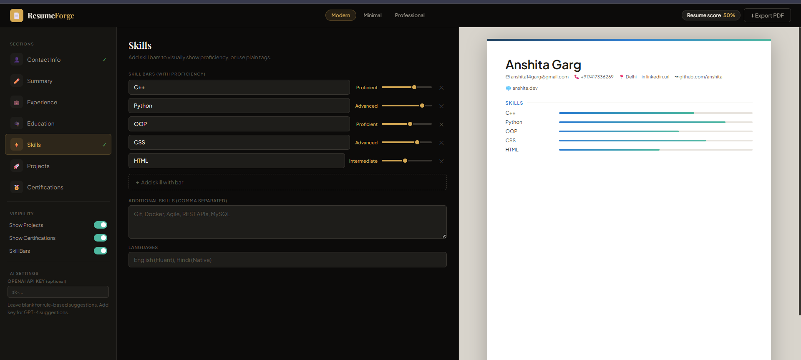
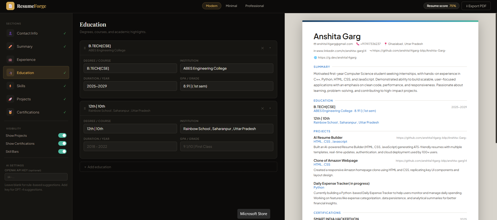
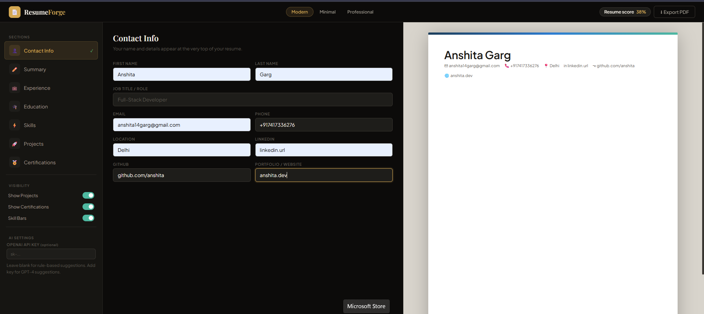
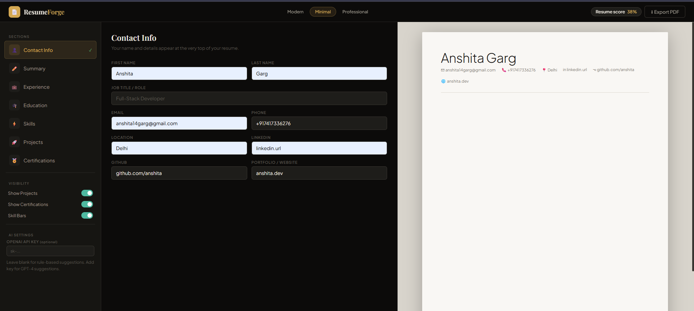
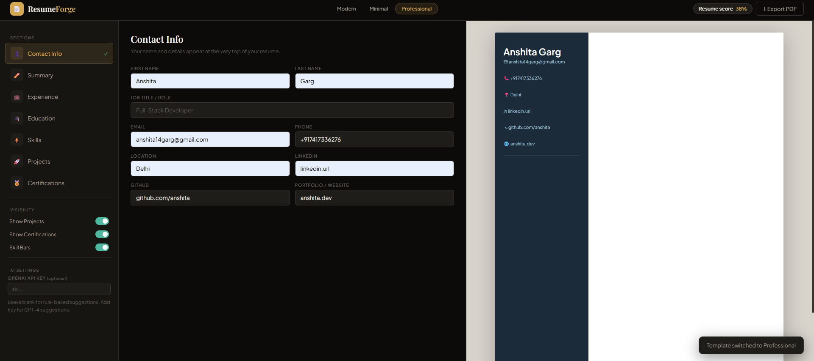

 🚀 ResumeForge – Smart Resume Builder

A modern, responsive resume builder that allows users to create, preview, and export professional resumes instantly.

---

 ✨ Features

* 📝 Live resume preview
* 🎨 Multiple templates (Modern, Minimal, Professional)
* ➕ Add sections dynamically (Education, Experience, Projects)
* 📊 Skill bars with proficiency
* 📄 Export resume as PDF
* 💻 Fully responsive UI

---

📸 Screenshots

 🛠️ Editor Interface

 📄 Resume Preview

 🎨 Modern Template

 🎨 Minimal Template

 🧑‍💼 Professional Template

---

 🛠️ Tech Stack

* HTML
* CSS
* JavaScript

---
🚀 Live Demo

https://anshita14garg-blip.github.io/Anshita-Garg-/

---

🎥 Demo Video

https://youtu.be/dfexw5pS6-g

---

📌 Future Improvements

* Add backend for saving resumes
* User authentication
* More templates

---

👩‍💻 Author

Anshita Garg
